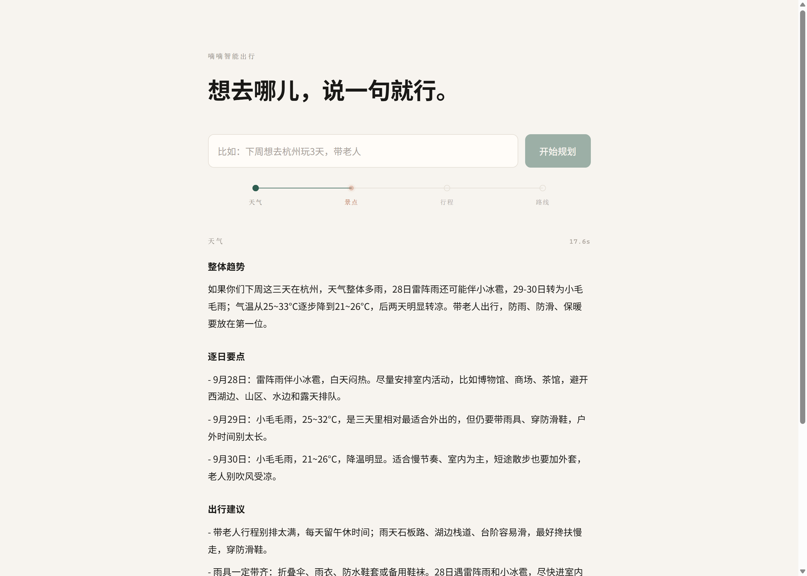
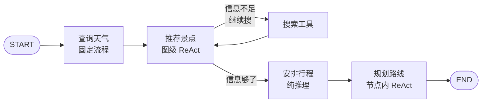

# 嘀嘀智能出行

> 基于 LangGraph 的多智能体出行规划助手 —— 一句「下周想去杭州玩 3 天，带老人」，换回一份完整的天气、景点、行程与路线。


---



*截图拍的是第 2 个节点正在跑的瞬间：进度轨道上「天气」已点亮、「景点」在脉冲，第一段结果已经流到页面上，右上角标着该段的实际耗时。*

---

## 它做什么

输入一句自然语言需求，四个 Agent 依次接力，产出四段结果：

| 阶段 | Agent | 产出 |
|---|---|---|
| ① | 查询天气 | 出行日期的天气趋势 + 穿衣提示 |
| ② | 推荐景点 | 结合天气与人群特点，搜索并筛选真实景点 |
| ③ | 安排行程 | 把景点排进每一天，考虑节奏与"带老人"这类约束 |
| ④ | 规划路线 | 每一天的具体交通方案（驾车 / 步行）与耗时 |

全程由**真实 API 驱动**，没有一条硬编码的假数据。

---

## 技术亮点：四种编排形态

这个项目刻意在同一张图里用了四种不同的 Agent 编排方式，用来对比它们各自适合什么场景：

| 节点 | 编排形态 | 实现方式 | 为什么选它 |
|---|---|---|---|
| **天气** | 固定流程 | LLM 解析需求 → 代码调工具 → LLM 总结 | 步骤确定，不需要模型自主决策 |
| **景点** | **图级 ReAct** | agent 节点 + 独立 tools 节点 + 条件边 | 搜索次数不定，需要模型自主判断"够了没" |
| **行程** | 纯推理 | 不调任何工具，直接生成 | 输入已齐备，纯属规划问题 |
| **路线** | **节点内 ReAct** | 循环藏在函数内部，图上只是一个普通节点 | 循环边界清晰，不必污染主图结构 |

**后两种形态的对比特别有意思**：同样是 ReAct 循环，景点节点把它摊在图上（`spots_agent ⇄ tools` 一眼看得见），路线节点把它收进函数里（图上看就是个普通节点）。选哪种取决于这个循环值不值得被主图感知。

---

## 架构



> 景点节点的"最多搜 N 次"刹车，踩在**给不给工具**上（`if 搜索次数 < MAX: llm.bind_tools(...)`），而不是直接在路由里返回 `END` —— 否则 LLM 来不及输出最终清单，`spots` 会是空的。

---

## 多轮对话怎么做的

图本身**完全不知道有"历史"这回事**。

`main.py` 在进图之前，先用一次 LLM 把「之前聊过的 + 这一句」合并成一句完整需求，再喂给图：

```
用户：下周想去杭州
用户：带老人                →  合并为 →  「下周想去杭州玩，带老人」
                            ↓
                        喂给图（走完整四环）
```

顺带分流闲聊：同一个判断顺带识别出「这不是出行需求」，直接回一句，**不跑图**。所以「你好」不会白白启动四个 Agent。

**代价**：每轮都重跑完整四环（约 1 分半），没做"只重跑受影响的环节"。这是刻意选择的简单方案 —— 图上一个字都不用改。

---

## 快速开始

### 1. 准备环境

```bash
python -m venv venv
venv\Scripts\activate          # Windows
pip install -r package/requirements.txt
```

### 2. 配置 `.env`

在**项目根目录**创建 `.env`：

```ini
# DeepSeek 大模型（走 OpenAI 兼容接口）
DEEPSEEK_API_KEY=你的key
DEEPSEEK_MODEL=deepseek-v4-flash
DEEPSEEK_BASE_URL=https://api.deepseek.com

# 高德地图 Web 服务（路线规划）
# ⚠️ 创建 Key 时必须选「Web服务」平台，选错调不通
AMAP_KEY=你的key

# Tavily 联网搜索（景点攻略）
TAVILY_API_KEY=你的key
```

> 天气数据走 [Open-Meteo](https://open-meteo.com/)，免费免注册，**不需要 key**。

### 3. 跑起来

**命令行版**

```bash
venv\Scripts\python.exe src\main.py
```

支持多轮对话 —— 可以接着说「换成 5 天」「那下雨的话呢」，按 `exit` 退出。

**网页版**

```bash
venv\Scripts\python.exe src\api.py
```

打开 http://127.0.0.1:8000 —— 页面有个**进度轨道**，四个节点跑完一个亮一个，结果边跑边往下冒（SSE 流式：进度轨道约 3 秒亮起，第一段结果约 15 秒到达，全部跑完约 1 分半）。

改代码想自动重启的话，换成：

```bash
venv\Scripts\python.exe -m uvicorn api:app --reload --app-dir src
```

接口文档在 http://127.0.0.1:8000/docs 。

---

## 项目结构

```
嘀嘀智能出行/
├── src/
│   ├── main.py           命令行入口：多轮对话 + 闲聊分流
│   ├── api.py            Web 入口：FastAPI + SSE 流式推送
│   ├── create_graph.py   组装图：创建节点对象 + 挂节点 + 连线
│   ├── agent_state.py    AgentState 定义（节点间只通过它传值）
│   ├── agent_node.py     四个节点的业务逻辑
│   ├── agent_tools.py    工具能力：天气 / 搜索 / 路线
│   ├── route.py          条件路由：岔路口怎么判断
│   ├── get_llm.py        LLM 统一出口（全局复用同一个实例）
│   ├── total_prompts.py  所有提示词集中管理
│   └── evals.py          评测集
├── static/
│   ├── page.html         前端页面（原生 HTML）
│   └── style.css         样式（原生 CSS，零构建）
├── package/
│   └── requirements.txt
└── .env                  ← 需自行创建，已被 gitignore
```

**文件分工的一条约定**：凡是"组装图"相关的（包括 `ToolNode` 这类没有自定义逻辑的节点对象），都放 `create_graph.py`；`agent_node.py` 只放有业务逻辑的节点函数。

---

## 评测

功能对不对，靠这个说话：

```bash
venv\Scripts\python.exe src/evals.py           # 快测：19 条意图用例，约 45 秒
venv\Scripts\python.exe src/evals.py --full    # 加上端到端慢测，每条约 1.5 分钟
```

**当前 19/19。**

判定标准 —— 意图识别这块最容易含糊，所以先把它写死：

- **要实时数据 → TRAVEL**（「杭州明天天气怎么样」）
- **靠常识能答 → CHAT**（「杭州是哪个省的」）
- **信息太少 → CHAT，但要追问得好**（「想去个凉快的地方」）

> **一个踩过的坑**：第一版把 3 条"模糊需求"的期望值写成了 TRAVEL，测出 14/18 就以为是系统有 bug。其实提示词里早写着"信息太少也算闲聊，追问一句"—— **是量表错了，不是系统错了**。改用例后才暴露出真正的问题：`北京现在多少度` 判成 CHAT、`杭州明天天气怎么样` 判成 TRAVEL，**同类Case判定不一致**。改完提示词才到 19/19。

慢测还发现了一个反直觉的事实：**最慢的是纯推理的"安排行程"节点（43~55 秒），比带搜索工具的景点节点（16~25 秒）慢一倍多** —— 因为它的输出最长，且不带工具调用（无法快速返回）。

---

## 技术栈

| 用途 | 选型 |
|---|---|
| 图编排 | LangGraph 1.2.10 |
| 大模型 | DeepSeek（经 `langchain-openai` 的 OpenAI 兼容接口） |
| Web 服务 | FastAPI + uvicorn |
| 流式推送 | SSE（`StreamingResponse` + `text/event-stream`） |
| 天气数据 | Open-Meteo（免费、免注册、无需 key） |
| 地图与路线 | 高德地图 Web 服务 API |
| 联网搜索 | Tavily |
| 前端 | 原生 HTML + CSS，零构建 |

---

## 已知限制

- **没有"按需跑图"**：即使第一段就发现城市不存在，后面三段依然会跑完（约 28 秒白跑）。加条件边可以解决，但会引入更多分支。
- **每轮重跑全图**：多轮对话时没有做增量更新。
- **单城市**：暂不支持跨城市的行程规划。
- **无持久化**：不存历史，重启即清空。
